---
# Please do not edit this file directly; it is auto generated.
# Instead, please edit 01-r-plotting.md in _episodes_rmd/
source: Rmd
title: "R for Plotting"
teaching: 150
exercises: 20
questions:
- "What are R and R Studio?"
- "How do I write code in R?"
- "What is the tidyverse?"
- "How do I read data into R?"
- "What are geometries and aesthetics?"
- "How can I use R to create and save professional data visualizations?"
objectives:
- "To become oriented with R and R Studio."
- "To create plots with both discrete and continuous variables."
- "To understand mapping and layering using `ggplot2`."
- "To be able to modify a plot's color, theme, and axis labels."
- "To be able to save plots to a local directory."
keypoints:
- "R is a free programming language used by many for reproducible data analysis."
- "Geometries are the visual elements drawn on data visualizations (lines, points, etc.), and aesthetics are the visual properties of those geometries (color, position, etc.)."
- "Use `ggplot()` and geoms to create data visualizations, and save them using `ggsave()`."
editor_options: 
  chunk_output_type: console
---

### Contents

1. [Introduction to R and RStudio](#introduction-to-r-and-rstudio)
1. [Introduction to the tidyverse](#introduction-to-the-tidyverse)
1. [Loading and reviewing data](#loading-and-reviewing-data)
1. [Understanding commands](#understanding-commands)
1. [Creating our first plot](#creating-our-first-plot)
1. [Plotting for data exploration](#plotting-for-data-exploration)
    + [Importing datasets](#importing-datasets)
    + [Discrete plots](#discrete-plots)
    + [Layers](#layers)
    + [Color vs. Fill](#color-vs-fill)
    + [Univariate plots](#univariate-plots)
    + [Plot themes](#plot-themes)
    + [Facets](#facets)
    + [Saving plots](#saving-plots)
1. [Glossary of terms](#glossary-of-terms)

> ## Bonus: why learn to program?
> Share why you're interested in learning how to code.
> > ## Solution:
> > There are lots of different reasons, including to perform data analysis and generate figures. I'm sure you have more specific reasons for why you'd like to learn! Add a line to your introduction explaining your motivation to learn to code.
> {: .solution}
{: .challenge}

# Introduction to R and RStudio
_[Back to top](#contents)_

Over this workshopm we will be working with data gathered by the Lake Superior National Estuarine Research Reserve (LSNERR), as part of their system-wide monitoring program (SWMP). SWMP encompasses frequent and high-quality water quality, weather, nutrient, and wetland plant community data, and is **always** publicly available. You can access SWMP data here. For this workshop, we'll work with a subset of these data, to analyse trends in water quality across the estuary. 

To do this, we'll need two things: data and a platform to analyze the data.

You already [downloaded the data]({{ page.root }}/setup.html). But what platform will we use to analyze the data? We have many options!

We could try to use a spreadsheet program like Microsoft Excel or Google sheets that have limited access, less flexibility, and don't easily allow for things that are critical to ["reproducible" research](https://journals.plos.org/ploscompbiol/article?id=10.1371/journal.pcbi.1003285), like easily sharing the steps used to explore and make changes to the original data.

Instead, we'll use a programming language to test our hypothesis. Today we will use R, but we could have also used Python for the same reasons we chose R (and we teach workshops for both languages). Both R and Python are freely available, the instructions you use to do the analysis are easily shared, and by using reproducible practices, it's straightforward to add more data or to change settings like colors or the size of a plotting symbol.

> ## But why R and not Python?
> [There's no great reason](http://www.academichermit.com/2020/03/23/Why-R.html).
> Although there are subtle differences between the languages, it's ultimately a matter of personal preference. Both are powerful and popular languages that have very well developed and welcoming communities of scientists that use them. As you learn more about R, you may find things that are annoying in R that aren't so annoying in Python; the same could be said of learning Python. If the community you work in uses R, then you're in the right place.
>
{: .solution}

To run R, all you really need is the R program, which is available for computers running the Windows, Mac OS X, or Linux operating systems. You downloaded R while getting [set up]({{ page.root }}/setup.html) for this workshop.

To make your life in R easier, there is a great (and free!) program called RStudio that you also downloaded and used during [set up]({{ page.root }}/setup.html). As we work today, we'll use features that are available in RStudio for writing and running code, managing projects, installing packages, getting help, and much more. It is important to remember that R and RStudio are different, but complementary programs. You need R to use RStudio.

> Bonus Exercise: Can you think of a reason you might not want to use RStudio?
>
> > ## Solution:
> > On some high-performance computer systems (e.g. Amazon Web Services) you typically can't get a display like RStudio to open. In that case, you'll write your code in R Scripts, and then run those scripts from the command line.
> {: .solution}
{: .challenge}

To get started, we'll spend a little time getting familiar with the RStudio environment and setting it up to suit your tastes. When you start RStudio, you'll have three panels.

On the left you'll have a panel with three tabs - Console, Terminal, and Jobs. The Console tab is what running R from the command line looks like. This is where you can enter R code. Try typing in `2+2` at the prompt (>). In the upper right panel are tabs indicating the Environment, History, and a few other things. If you click on the History tab, you'll see the command you ran at the R prompt.

In the lower right panel are tabs for Files, Plots, Packages, Help, and Viewer.

We'll spend more time in each of these tabs as we go through the workshop, so we won't spend a lot of time discussing them now.

You might want to alter the appearance of your RStudio window. The default appearance has a white background with black text. If you go to the Tools menu at the top of your screen, you'll see a "Global options" menu at the bottom of the drop down; select that.

From there you will see the ability to alter numerous things about RStudio. Under the Appearances tab you can select the theme you like most. As you can see there's a lot in Global options that you can set to improve your experience in RStudio. Most of these settings are a matter of personal preference.

However, you can update settings to help you to insure the reproducibility of your code. In the General tab, none of the selectors in the R Sessions, Workspace, and History should be selected. In addition, the toggle next to "Save workspace to .RData on exit" should be set to never. These setting will help ensure that things you worked on previously don't carry over between sessions.

Let's get going on our analysis!

One of the helpful features in RStudio is the ability to create a project. A project is a special directory that contains all of the code and data that you will need to run an analysis.

At the top of your screen you'll see the "File" menu. Select that menu and then the menu for "New Project...".

When the smaller window opens, select "Existing Directory" and then the "Browse" button in the next window.

Navigate to the directory that contains your code and data from the setup instructions and click the "Open" button. Note that in the screenshots below, this folder says "un-report" - for us, it should say "nerr_data".

Then click the "Create Project" button.

Did you notice anything change?

In the lower right corner of your RStudio session, you should notice that your
Files tab is now your project directory. You'll also see a file called
nerr_data.Rproj in that directory.

From now on, you should start RStudio by double clicking on that file. This will
make sure you are in the correct directory when you run your analysis.

We'd like to create a file where we can keep track of our R code.

Back in the "File" menu, you'll see the first option is "New File". Selecting "New File" opens another menu to the right and the first option is "R Script". Select "R Script".

Now we have a fourth panel in the upper left corner of RStudio that includes an **Editor** tab with an untitled R Script. Let's save this file as `plotting.R` in our project directory. Go to "File" -> "Save" and enter "plotting.R"

We will be entering R code into the **Editor** tab to run in our **Console** panel.

On line 1 of `plotting.R`, type `2+2`.

With your cursor on the line with the `2+2`, click the button that says <kbd>Run</kbd>. You should be able to see that `2+2` was run in the Console.

As you write more code, you can highlight multiple lines and then click <kbd>Run</kbd> to run all of the lines you have selected.

# Introduction to the Tidyverse
_[Back to top](#contents)_

In this session we will learn how to read data into R and plot it, allowing us to explore how environmental variables affect the microbes of Lake Ontario. We'll use functions from the `tidyverse` to make working with our data easier. 

> ## The tidyverse vs Base R
> If you've used R before, you may have learned commands that are different than the ones we will be using during this workshop. We will be focusing on functions from the [tidyverse](https://www.tidyverse.org/). The "tidyverse" is a collection of R packages that have been designed to work well together and offer many convenient features that do not come with a fresh install of R (aka "base R"). These packages are very popular and have a lot of developer support including many staff members from RStudio. These functions generally help you to write code that is easier to read and maintain. We believe learning these tools will help you become more productive more quickly.
{: .callout}

Let's start by loading a package called `tidyverse`. In `plotting.R`, type and run:

~~~
library(tidyverse)
~~~
{: .language-r}

~~~
── Attaching core tidyverse packages ───────────────────────────────────────────────────────────────────────────────────────────────────────────────────────────────────────── tidyverse 2.0.0 ──
✔ dplyr     1.1.4     ✔ readr     2.1.5
✔ forcats   1.0.1     ✔ stringr   1.6.0
✔ ggplot2   4.0.0     ✔ tibble    3.3.0
✔ lubridate 1.9.4     ✔ tidyr     1.3.1
✔ purrr     1.2.0     
── Conflicts ─────────────────────────────────────────────────────────────────────────────────────────────────────────────────────────────────────────────────────────── tidyverse_conflicts() ──
✖ dplyr::filter() masks stats::filter()
✖ dplyr::lag()    masks stats::lag()
ℹ Use the conflicted package (<http://conflicted.r-lib.org/>) to force all conflicts to become errors
~~~
{: .output}

> ## What's with all those messages???
>
> When you loaded the `tidyverse` package, you probably got a message like the
> one we got above. Don't panic! These messages are just giving you more
> information about what happened when you loaded `tidyverse`. The `tidyverse` is
> actually a collection of several different packages, so the first section of the
> message tells us what packages were installed when we loaded `tidyverse` (these
> include `ggplot2`, which we'll be using a lot in this lesson, and `dyplr`, which
> you'll be introduced to tomorrow in the 
> [R for Data Analysis lesson]({{ page.root }}/05-r-markdown)).
>
> The second section of messages gives a list of "conflicts." Sometimes, the
> same function name will be used in two different packages, and R has to decide
> which function to use. For example, our message says that:
>
> ~~~
> dplyr::filter() masks stats::filter()
> ~~~
> {: .output}
>
> This means that two different packages (`dyplr` from `tidyverse` and `stats`
> from base R) have a function named `filter()`. By default, R uses the function
> that was most recently loaded, so if we try using the `filter()` function after
> loading `tidyverse`, we will be using the `filter()` function > from `dplyr()`.
>
{: .callout}

> ## Pro-tip
>
> Those of us that use R on a daily basis use cheat sheets to help us remember how to use various R functions.
>
> You can find them in RStudio by going to the "Help" menu and selecting "Cheat Sheets". The one that will be most helpful in this workshop are "Data Visualization with ggplot2".
>
> For things that aren't on the cheat sheets, [Google is your best friend]({{ page.root }}/06-conclusion/). Even expert coders use Google when they're stuck or trying something new!
>
{: .testimonial}

---

# Loading and reviewing data
_[Back to top](#contents)_

We will import a file containing data from Ontario samples called `water_quality.csv`. We will import it into R using a function from the tidyverse called `read_csv`:

~~~
water_quality <- read_csv("water_quality.csv")
~~~
{: .language-r}

~~~
Rows: 306 Columns: 9
── Column specification ─────────────────────────────────────────────────────────────────────────────────────────────────────────────────────────────────────────────────────────────────────────
Delimiter: ","
chr (1): Station
dbl (8): Year, DayofYear, Temp, Conductivity, DO, pH, Turbidity, ChlFluor

ℹ Use `spec()` to retrieve the full column specification for this data.
ℹ Specify the column types or set `show_col_types = FALSE` to quiet this message.
~~~
{: .output}

> ## `read_csv` vs. `read.csv`
>
> When you began typing the `read_csv` command, a very similarly named function, `read.csv`, may have popped up. These commands both do the same thing - they read in data from .csv files. The `read.csv` function is from "base" R (the packages and code that is automatically loaded), while `read_csv` is from the `readr` package in the tidyverse. They are very similar and are often interchangeable. The way they print data tables in the console is different, though, as is how they handle messier data tables. In this lesson, these functions **won't** be interchangeable for us. So to keep us consistent, please confirm that you are using `read_csv`.
>
{: .callout}

Look at the "Environment" tab. Here you will see a list of all the objects you've created or imported during your R session. Do you see an object called `water_quality`? Click on the small table to the right of `water_quality` to View our dataset. This is a quick way to browse your data to make sure everything looks like it has been imported correctly.

We see that our data has 9 columns (variables).

We have the Year, and DayofYear (from 1 to 365), as well as the Station where these samples were taken. Reference the map below to see these stations' locations. We also have temperature ("Temp", in °C), Conductivity (mS/cm), Dissolved Oxygen ("DO", in mg/L), pH, Turbidity (NTU), and chlorophyll fluorescence ("ChlFluor", in RFU). These data are a subset of the full SWMP data that's available - we're only using one sample per week from 2022-2024, while the real SWMP data extends to 2012 and has samples every fifteen minutes!

After we've reviewed the data, you'll want to make sure to click the tab in the upper left to return to your `plotting.R` file so we can return to our R script.

> ## Data frames vs. tibbles
> Functions from the "tidyverse" such as `read_csv` work with objects called "tibbles", which are a specialized kind of "data.frame." Another common way to store data is a "data.table". All of these types of data objects (tibbles, data.frames, and data.tables) can be used with the commands we will learn in this lesson to make plots. We may sometimes use these terms interchangeably.
{: .callout}

# Understanding commands
_[Back to top](#contents)_

Let's take a closer look at the `read_csv` command we typed.

Starting from the left, the first thing we see is `water_quality`. We viewed the contents of this file after it was imported so we know that `water_quality` acts as a placeholder for our data.

If we highlight just `water_quality` within our code file and press <kbd>Ctrl</kbd>+<kbd>Enter</kbd> on our keyboard, what do we see?

We should see a data table outputted, similar to what we saw in the Viewer tab.

In R terms, `water_quality` is a named object that references or stores something. In this case, `water_quality` stores a specific table of data.

When we're coding in R, we often want to assign a value, or a collection of values, to an **object**, which means we gave those values a name. To create an object in R, we'll use the `<-` symbol, which is the **assignment operator**. It assigns values generated or typed on the right to objects on the left. We can see our objects in the Environment pane. 

An alternative symbol that you might see used as an **assignment operator** is the `=` but it is clearer to only use `<-` for assignment. We use this symbol so often that RStudio has a keyboard short cut for it: <kbd>Alt</kbd>+<kbd>-</kbd> on Windows, and <kbd>Option</kbd>+<kbd>-</kbd> on Mac. You can retrieve the values you stored by typing the name of the object. 

> ## Assigning values to objects
> Try to assign values to some objects and observe each object after you have assigned a new value. What do you notice?
>
> 
> ~~~
> name <- "daphnia"
> name
> year <- 1863
> year
> name <- "Hattie Bell"
> name
> ~~~
> {: .language-r}
> {: .source}
>
> > ## Solution
> > When we assign a value to an object, the object stores that value so we can access it later. However, if we store a new value in an object we have already created (like when we stored "Hattie Bell" in the `name` object), it replaces the old value. The `year` object does not change, because we never assign it a new value.
> {: .solution}
{: .challenge}

> ## Guidelines on naming objects
> - You want your object names to be explicit and not too long.
> - They cannot start with a number (2x is not valid, but x2 is).
> - R is case sensitive, so for example, weight_kg is different from Weight_kg.
> - You cannot use spaces in the name.
> - There are some names that cannot be used because they are the names of fundamental functions in R (e.g., if, else, for; see [here](https://stat.ethz.ch/R-manual/R-devel/library/base/html/Reserved.html) for a complete list). If in doubt, check the help to see if the name is already in use (`?function_name`).
> - It's best to avoid dots (.) within names. Many function names in R itself have them and dots also have a special meaning (methods) in R and other programming languages.
> - It is recommended to use nouns for object names and verbs for function names.
> - Be consistent in the styling of your code, such as where you put spaces, how you name objects, etc. Using a consistent coding style makes your code clearer to read for your future self and your collaborators. One popular style guide can be found through the [tidyverse](https://style.tidyverse.org/).
{: .checklist}

> ## Bonus Exercise: Bad names for objects
> Try to assign values to some new objects. What do you notice? After running all four lines of code bellow, what value do you think the object `Flower` holds?
>
> 
> ~~~
> 1number <- 3
> Flower <- "marigold"
> flower <- "rose"
> favorite number <- 12
> ~~~
> {: .language-r}
> {: .source}
>
> > ## Solution
> > Notice that we get an error when we try to assign values to `1number` and `favorite number`. This is because we cannot start an object name with a numeral and we cannot have spaces in object names. The object `Flower` still holds "marigold." This is because R is case-sensitive, so running `flower <- "rose"` does NOT change the `Flower` object. This can get confusing, and is why we generally avoid having objects with the same name and different capitalization.
> {: .solution}
{: .challenge}

The next part of the command is `read_csv("water_quality.csv")`. This has a few different key parts. The first part is the `read_csv` function. You call a function in R by typing it's name followed by opening, then closing, parenthesis. Each function has a purpose, which is often hinted at by the name of the function. Let's try to run the function without anything inside the parenthesis.

~~~
read_csv()
~~~
{: .language-r}

~~~
Error in read_csv(): argument "file" is missing, with no default
~~~
{: .error}

We get an error message. Don't panic! Error messages pop up all the time, and can be super helpful in debugging code.

> ## Warnings and Errors
> It's important to differentiate between Warnings and Errors in R. A warning tells us, "you might want to know about this issue, but R still did what you asked". An error tells us, "there's something wrong with your code or your data and R didn't do what you asked". You need to fix any errors that arise. Warnings, on the other hand, are probably best to resolve or at least understand why they are coming up.
{.callout}

In this case, the message tells us "argument "file" is missing, with no default." Many functions, including `read_csv`, require additional pieces of information to do their job. We call these additional values "arguments" or "parameters." You pass **arguments** to a function by placing values in between the parenthesis. A function takes in these arguments and does some tasks behind the scenes to output something we're interested in.

For example, when we loaded in our data, the command contained `"water_quality.csv"` inside the `read_csv()` function. This is the value we assigned to the file argument. But we didn't say that that was the file. How does that work?

> ## Pro-tip
>
> Each function has a help page that documents what arguments the function
> expects and what value it will return. You can bring up the help page a few
> different ways. You can go to the "Help" tab in the lower right and search for a function. You can
> also type `?` followed by the function name in the console.
>
> For example, try running `?read_csv`. A help page should pop up with
> information about what the function is used for and how to use it, as well as
> useful examples of the function in action. As you can see, the first
> **argument** of `read_csv` is the file path.
>
{: .callout}

The `read_csv()` function took the file path we provided, did who-knows-what behind the scenes, and then outputted an R object with the data stored in that csv file. All that, with one short line of code!

Do all functions need arguments? Let's test some other functions:

~~~
Sys.Date()
~~~
{: .language-r}

~~~
[1] "2025-11-07"
~~~
{: .output}

~~~
getwd()
~~~
{: .language-r}

~~~
"/Users/augustuspendleton/Desktop/nerr_data"
~~~
{: .output}

While some functions, like those above, don't need any arguments, in other
functions we may want to use multiple arguments. When we're using multiple
arguments, we separate the arguments with commas. For example, we can use the
`sum()` function to add numbers together:

~~~
sum(5, 6)
~~~
{: .language-r}

~~~
[1] 11
~~~
{: .output}

> ## Learning more about functions
> Look up the function `round`. What does it do? What will you get as output for the following lines of code?
>
> 
> ~~~
> round(3.1415)
> round(3.1415,3)
> ~~~
> {: .language-r}
> {: .source}
>
> > ## Solution
> > `round` rounds a number. By default, it rounds it to zero digits (in our example above, to 3). If you give it a second number, it rounds it to that number of digits (in our example above, to 3.142)
> {: .solution}
{: .challenge}

Notice how in this example, we didn't include any argument names. But you can
use argument names if you want:

~~~
read_csv(file = 'water_quality.csv')
~~~
{: .language-r}

~~~
Error: 'data/water_quality.csv' does not exist in current working directory ('/Users/augustuspendleton/Desktop/Coding/Carpentries_Workshops/SLR_Summit_Workshop/_episodes_rmd').
~~~
{: .error}

> ## Position of the arguments in functions
> Which of the following lines of code will give you an output of 3.14? For the one(s) that don't give you 3.14, what do they give you?
>
> 
> ~~~
> round(x = 3.1415)
> round(x = 3.1415, digits = 2)
> round(digits = 2, x = 3.1415)
> round(2, 3.1415)
> ~~~
> {: .language-r}
> {: .source}
>
> > ## Solution
> > The 2nd and 3rd lines will give you the right answer because the arguments are named, and when you use names the order doesn't matter. The 1st line will give you 3 because the default number of digits is 0. Then 4th line will give you 2 because, since you didn't name the arguments, x=2 and digits=3.1415.
> {: .solution}
{: .challenge}

Sometimes it is helpful - or even necessary - to include the argument name, but often we can skip the argument name, if the argument values are passed in a certain order. If all this function stuff sounds confusing, don't worry! We'll see a bunch of examples as we go that will make things clearer.

> ## Comments
> Sometimes you may want to write comments in your code to help you remember
> what your code is doing, but you don't want R to think these comments are a part
> of the code you want to evaluate. That's where **comments** come in! Anything
> after a `#` symbol in your code will be ignored by R. For example, let's say we
> wanted to make a note of what each of the functions we just used do:
> 
> ~~~
>  Sys.Date()  # outputs the current date
> ~~~
> {: .language-r}
> 
> 
> 
> ~~~
> [1] "2025-11-07"
> ~~~
> {: .output}
> 
> 
> 
> ~~~
>  getwd()     # outputs our current working directory (folder)
> ~~~
> {: .language-r}
> 
> 
> 
> ~~~
> [1] "/Users/augustuspendleton/Desktop/Coding/Carpentries_Workshops/SLR_Summit_Workshop/_episodes_rmd"
> ~~~
> {: .output}
> 
> 
> 
> ~~~
>  sum(5, 6)   # adds numbers
> ~~~
> {: .language-r}
> 
> 
> 
> ~~~
> [1] 11
> ~~~
> {: .output}
> 
> ~~~
>  read_csv(file = 'water_quality.csv') # reads in csv file
> ~~~
> {: .language-r}
> 
> ~~~
> Error: 'data/water_quality.csv' does not exist in current working directory ('/Users/augustuspendleton/Desktop/Coding/Carpentries_Workshops/SLR_Summit_Workshop/_episodes_rmd').
> ~~~
> {: .error}
{: .callout}

# Creating our first plot
_[Back to top](#contents)_

We will be using the `ggplot2` package today to make our plots. This is a very
powerful package that creates professional looking plots and is one of the
reasons people like using R so much. All plots made using the `ggplot2` package
start by calling the `ggplot()` function. So in the tab you created for the
`plotting.R` file, type the following:

~~~
ggplot(data=water_quality)
~~~
{: .language-r}

To run code that you've typed in the editor, you have a few options. Remember
that the quickest way to run the code is by pressing
<kbd>Ctrl</kbd>+<kbd>Enter</kbd> on your keyboard. This will run the line of
code that currently contains your cursor or any highlighted code.

When we run this code, the **Plots** tab will pop to the front in the lower
right corner of the RStudio screen. Right now, we just see a big grey rectangle.

What we've done is created a ggplot object and told it we will be using the data
from the `water_quality` object that we've loaded into R. We've done this by
calling the `ggplot()` function with `water_quality` as the `data` argument.

So we've made a plot object, now we need to start telling it what we actually
want to draw in this plot. The elements of a plot have a bunch of properties
like an x and y position, a size, a color, etc. These properties are called
**aesthetics**. When creating a data visualization, we  map a variable in our
dataset to an aesthetic in our plot. In ggplot, we can do this by creating an
"aesthetic mapping", which we do with the `aes()` function.

To create our plot, we need to map variables from our `water_quality` object to
ggplot aesthetics using the `aes()` function. Since we have already told
`ggplot` that we are using the data in the `water_quality` object, we can
access the columns of `water_quality` using the object's column names.
(Remember, R is case-sensitive, so we have to be careful to match the column
names exactly!)

We are going to start by testing whether there is a relationship between temperature and dissolved oxygen, so let's start by telling our plot object that we want to map our temperature values to the x axis of our plot. We do this by adding (`+`) information to
our plot object. Add this new line to your code and run both lines by
highlighting them and pressing <kbd>Ctrl</kbd>+<kbd>Enter</kbd> on your
keyboard:

~~~
ggplot(data = water_quality) +
  aes(x = Temp)
~~~
{: .language-r}

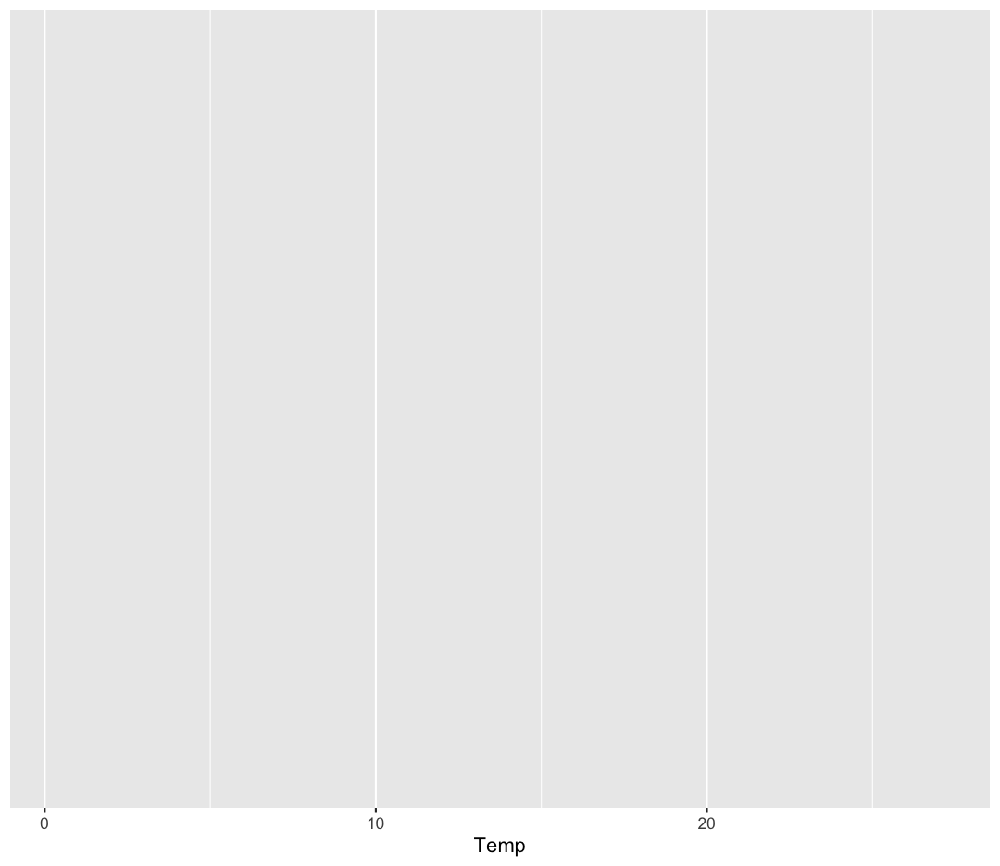

Note that we've added this new function call to a second line just to make it
easier to read. To do this we make sure that the `+` is at the end of the first
line otherwise R will assume your command ends when it starts the next row. The
`+` sign indicates not only that we are adding information, but to continue on
to the next line of code.

Observe that our **Plot** window is no longer a grey square. We now see that
we've mapped the `Temp` column to the x axis of our plot. Note that that
column name isn't very pretty as an x-axis label, so let's add the `labs()`
function to make a nicer label for the x axis

~~~
ggplot(data = water_quality) +
  aes(x = Temp) +
  labs(x = "Temperature (C)")
~~~
{: .language-r}

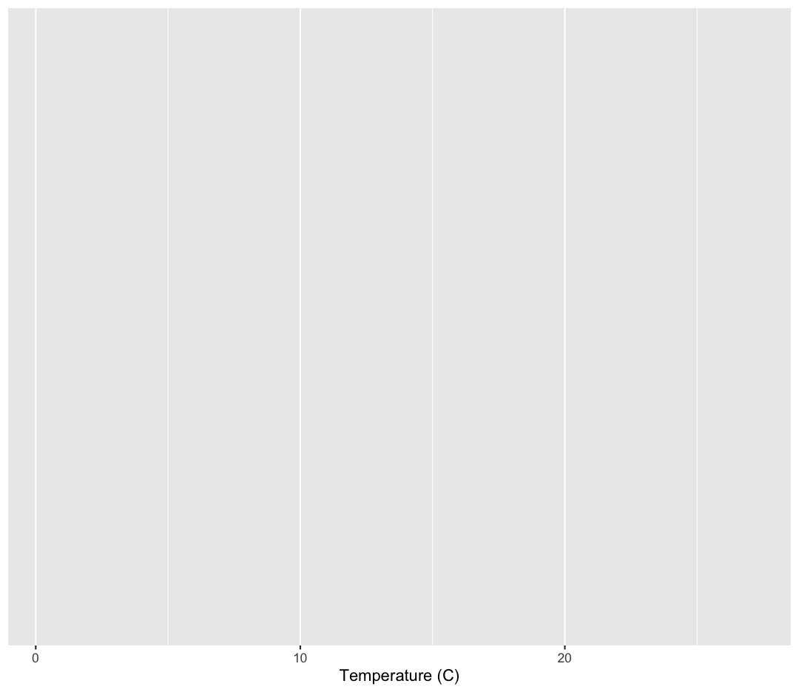

OK. That looks better. 

> ## Quotes vs No Quotes
> Notice that when we added the label value we did so by placing the values
> inside quotes. This is because we are not referencing a variable from inside our data
> object - we are providing the name directly. When you need to include actual
> text values in R, they will be placed inside quotes to tell them apart from
> other object or variable names.
> 
> The general rule is that if you want to use values from the columns of your
> data object, then you supply the name of the column without quotes, but if you
> want to specify a value that does not come from your data, then use quotes.
{: .callout}

> ## Mapping dissolved oxygen to the y axis
> Map our `DO` values to the y axis and give them a nice label.
> {: .source}
>
>
> > ## Solution
> > 
> > ~~~
> > ggplot(data = water_quality) +
> >   aes(x = Temp) +
> >   labs(x = "Temperature (C)") +
> >   aes(y = DO) +
> >   labs(y = "Dissolved Oxygen (mg/L)")
> > ~~~
> > {: .language-r}
> > 
> > 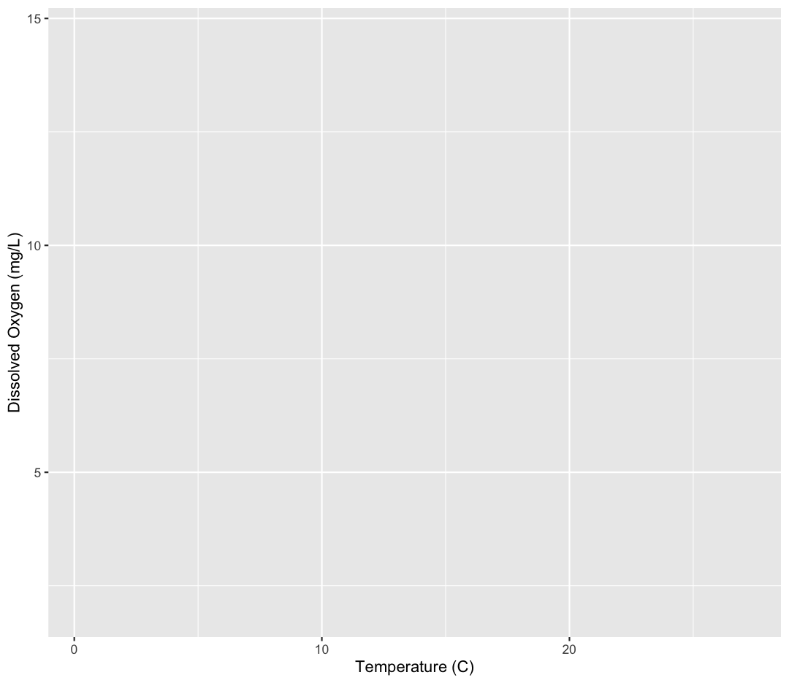
> > {: .source}
> {: .solution}
{: .challenge}

Excellent. We've now told our plot object where the x and y values are coming
from and what they stand for. But we haven't told our object how we want it to
draw the data. There are many different plot types (bar charts, scatter plots,
histograms, etc). We tell our plot object what to draw by adding a "geometry"
("geom" for short) to our object. We will talk about several different geometries
today, but for our first plot, let's draw our data using the "points" geometry
for each value in the data set. To do this, we add `geom_point()` to our plot
object:

~~~
ggplot(data = water_quality) +
  aes(x = Temp) +
  labs(x = "Temperature (C)") +
  aes(y = DO) +
  labs(y = "Dissolved Oxygen (mg/L)") +
  geom_point()
~~~
{: .language-r}

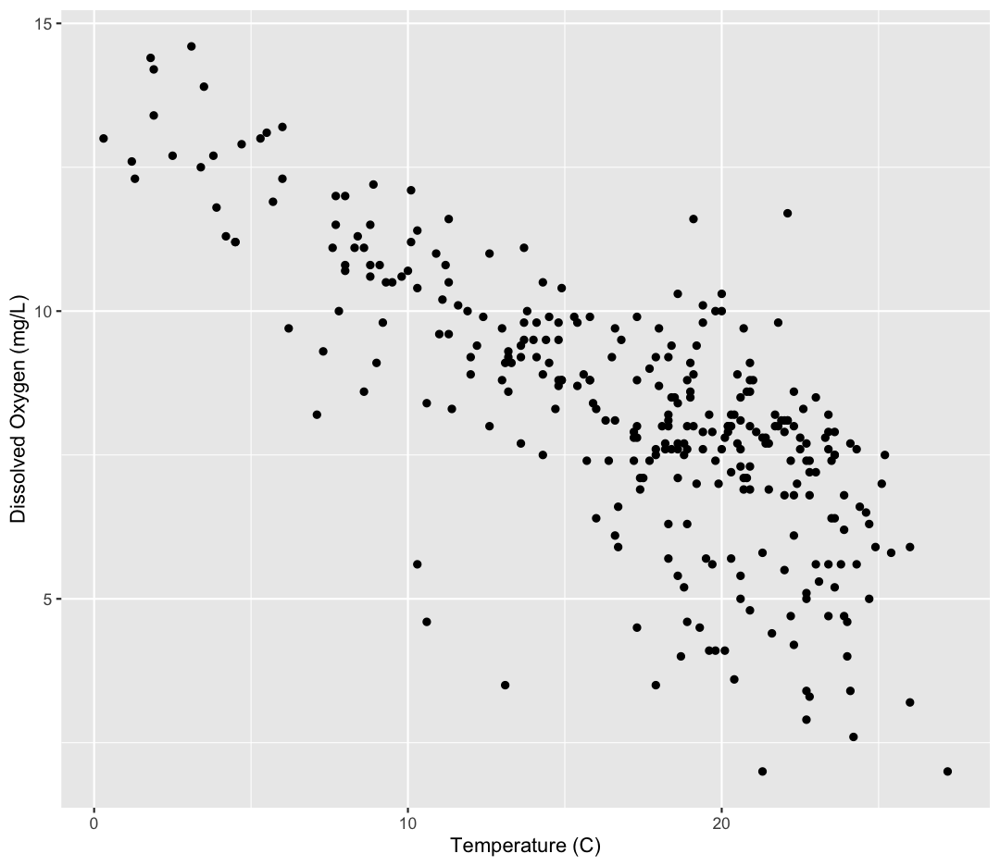

Now we're really getting somewhere. It finally looks like a proper plot!  We can
now see a trend in the data. It looks like samples with a higher temperature tend to
have higher dissolved oxygen. Let's add a title to our plot to make that
clearer. Again, we will use the `labs()` function, but this time we will use the
`title =` argument.

~~~
ggplot(data = water_quality) +
  aes(x = Temp) +
  labs(x = "Temperature (C)") +
  aes(y = DO) +
  labs(y = "Dissolved Oxygen (mg/L)") +
  geom_point() +
  labs(title = "As temperature rises, oxygen decreases")
~~~
{: .language-r}

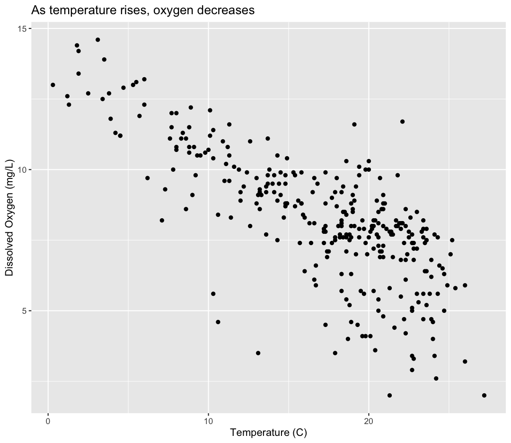

No one can deny we've made a very handsome plot! But now looking at the data, we
might be curious about learning more - for example, we know these data were taken at four different stations. Maybe we are curious if the trend between temperature and oxygen is consistent between our three environmental groups. One thing we
could do is use a different color for each of these groups. To map the
`Station` of each point to a color, we will again use the `aes()` function:

~~~
ggplot(data = water_quality) +
  aes(x = Temp) +
  labs(x = "Temperature (C)") +
  aes(y = DO) +
  labs(y = "Dissolved Oxygen (mg/L)") +
  geom_point() +
  labs(title = "As temperature rises, oxygen decreases") +
  aes(color = Station)
~~~
{: .language-r}

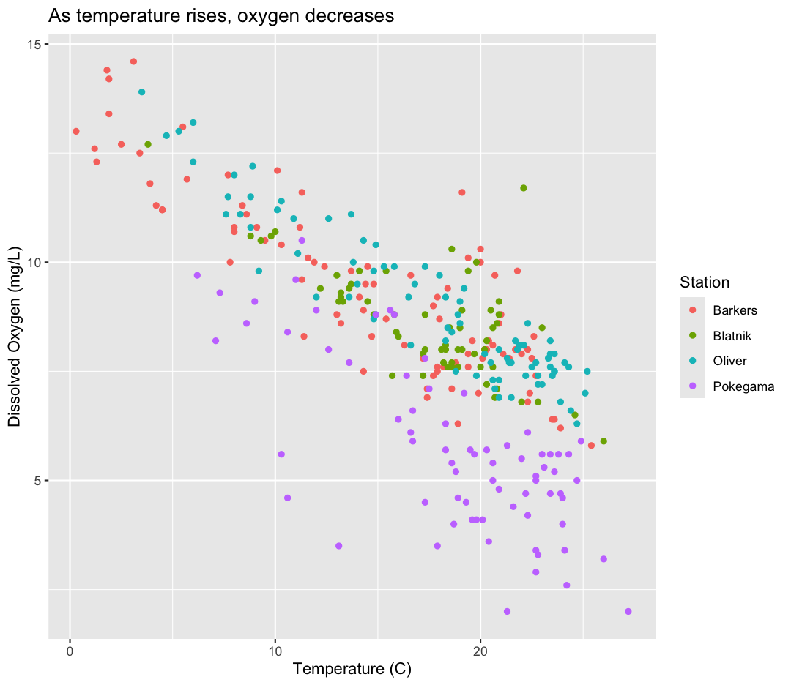

Here we can see that Pokegama samples consistently have lower oxygen than the other stations. Notice that when we add a mapping for
color, ggplot automatically provided a legend for us. It took care of assigning
different colors to each of our unique values of the `Station` variable. (Note
that when we mapped the x and y values, those drew the actual axis labels, so in
a way the axes are like the legends for the x and y values). 

What other variables might help explain Pokegama's unique decrease in oxygen? Let's find out by mapping the turbidity (or "cloudiness") of each sample to the size of our points.

~~~
ggplot(data = water_quality) +
  aes(x = Temp) +
  labs(x = "Temperature (C)") +
  aes(y = DO) +
  labs(y = "Dissolved Oxygen (mg/L)") +
  geom_point() +
  labs(title = "As temperature rises, oxygen decreases") +
  aes(color = Station) +
  aes(size = Turbidity)
~~~
{: .language-r}

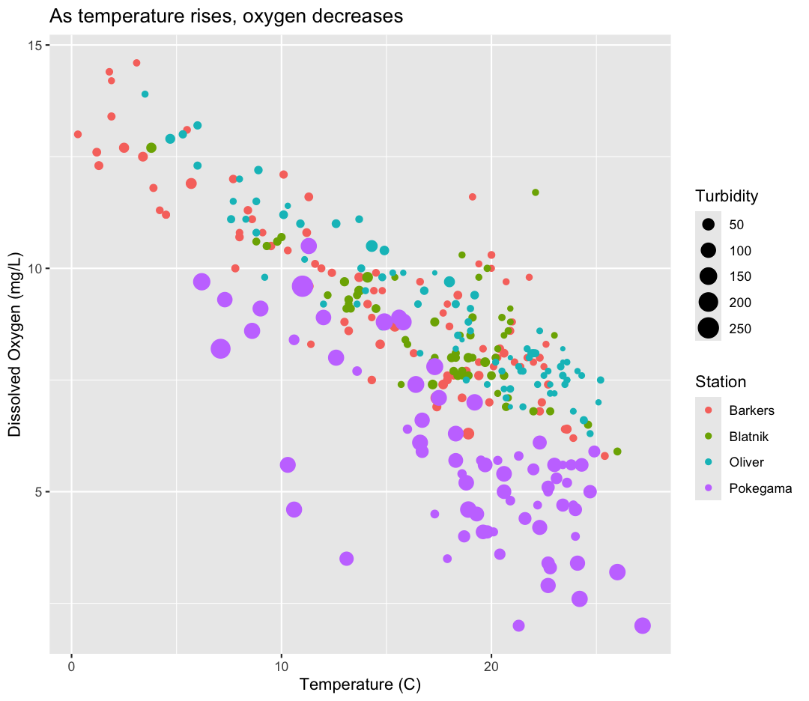

Interesting - Pokegama also has relatively high turbidity compared to the other stations. We got another legend here for size
which is nice, but the titles aren't very informative. Let's change those, using another calls to `labs()`

~~~
ggplot(data = water_quality) +
  aes(x = Temp) +
  labs(x = "Temperature (C)") +
  aes(y = DO) +
  labs(y = "Dissolved Oxygen (mg/L)") +
  geom_point() +
  labs(title = "As temperature rises, oxygen decreases") +
  aes(color = Station) +
  aes(size = Turbidity) +
  labs(size = "Turbidity (NTU)",
       color = "SWMP Station")
~~~
{: .language-r}

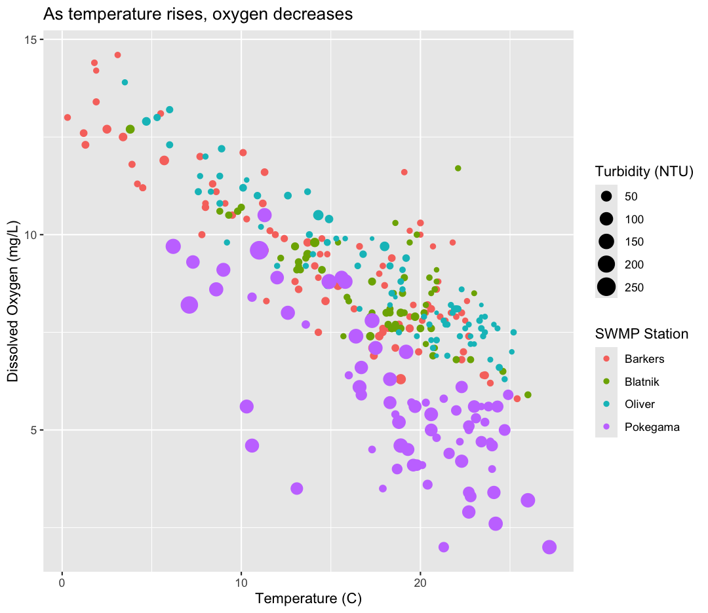

While we're at it, maybe I want our DO units to be in g/L, rather than mg. Let's change it by dividing our `DO` by 1,000 and updating our axis title to match.

~~~
ggplot(data = water_quality) +
  aes(x = Temp) +
  labs(x = "Temperature (C)") +
  aes(y = DO/1000) +
  labs(y = "Dissolved Oxygen (g/L)") +
  geom_point() +
  labs(title = "As temperature rises, oxygen decreases") +
  aes(color = Station) +
  aes(size = Turbidity) +
  labs(size = "Turbidity (NTU)",
       color = "SWMP Station")
~~~
{: .language-r}

This works because you can treat the columns in the aesthetic mappings just like
any other variables and can use functions to transform or change them at plot
time rather than having to transform your data first.

Good work! Take a moment to appreciate what a cool plot you made with a few
lines of code. In order to fully view its beauty you can click the "Zoom" button
in the **Plots** tab - it will break free from the lower right corner and open
the plot in its own window.

> ## Changing shapes
> Instead of (or in addition to) color, change the shape of the points so each Station has a different shape. (I'm not saying this is a great thing to do - it's just for practice!) HINT: Is size an aesthetic or a geometry? If you're stuck, feel free to Google it, or look at the help menu.
> {: .source}
>
> > ## Solution
> > You'll want to use the `aes` aesthetic function to change the shape:
> > 
> > ~~~
> > ggplot(data = water_quality) +
> >   aes(x = Temp) +
> >   labs(x = "Temperature (C)") +
> >   aes(y = DO/1000) +
> >   labs(y = "Dissolved Oxygen (g/L)") +
> >   geom_point() +
> >   labs(title = "As temperature rises, oxygen decreases") +
> >   aes(color = Station) +
> >   aes(size = Turbidity) +
> >   aes(shape = Station) +
> >   labs(size = "Turbidity (NTU)",
> >        color = "SWMP Station",
> >        shape = "SWMP Station")
> > ~~~
> > {: .language-r}
> > 
> > 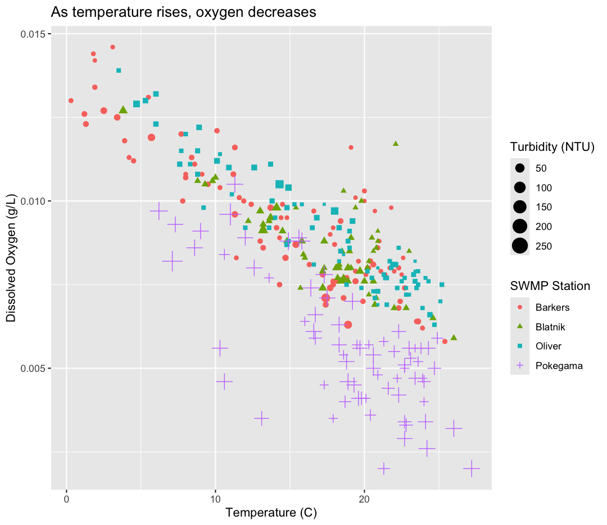
> > {: .source}
> {: .solution}
{: .challenge}

For our first plot we added each line of code one at a time so you could see the
exact affect it had on the output. But when you start to make a bunch of plots,
we can actually combine many of these steps so you don't have to type as much.
For example, you can collect all the `aes()` statements and all the `labs()`
together. A more condensed version of the exact same plot would look like this:

~~~
ggplot(data = water_quality) +
  aes(x = Temp, 
      y = DO/1000, 
      color = Station, 
      size = Turbidity) +
  geom_point() +
  labs(x = "Temperature (C)", 
       y = "Dissolved Oxygen (g/L)",
       title = "As temperature rises, oxygen decreases",
       size = "Turbidity (NTU)",
       color = "SWMP Station")
~~~
{: .language-r}

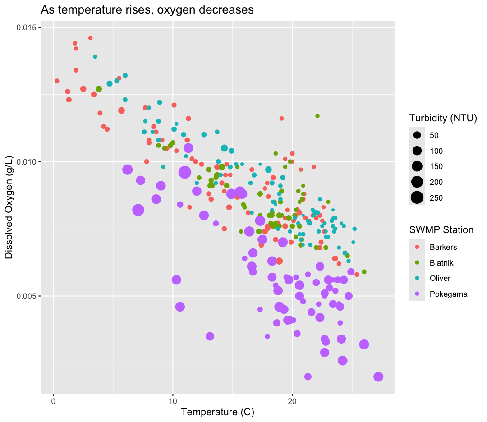

## Importing additional datasets
_[Back to top](#contents)_

In the first plot, we found that temperature had a major influence on dissolved oxygen, and Pokegama had consistently lower oxygen, perhaps partially due to its higher turbidity. In these analyses, we studied a trend between two variables, using samples from many different timepoints. What if we want to track the change of a variable over time?

To do so, we will read in a new dataset, called `water_quality_oliver.csv`, which is a subset of our water quality data that just includes samples from Oliver Bridge, but the variables are the same.

To start, we will read in the data using `read_csv`.

> ## Read in your own data
>
> What argument should be provided in the below code to read in the full dataset?
>
> 
> ~~~
> water_quality_oliver <- read_csv()
> ~~~
> {: .language-r}
>
> > ## Solution
> >
> > 
> > ~~~
> > water_quality_oliver <- read_csv("water_quality_oliver.csv")
> > ~~~
> > {: .language-r}
> {: .solution}
{: .challenge}

Let's take a look at the full dataset. We could use `View()`, the way we did for the smaller dataset, but if your data is too big, it might take too long to load. Luckily, R offers a way to look at parts of the data to get an idea of what your dataset looks like, without having to examine the whole thing. Here are some commands that allow us to get the dimensions of our data and look at a snapshot of the data. Try them out!

~~~
dim(water_quality_oliver)
~~~
{: .language-r}

~~~
[1] 84  8
~~~
{: .output}

~~~
head(water_quality_oliver)
~~~
{: .language-r}

~~~
# A tibble: 6 × 8
   Year DayofYear Station  Temp Conductivity    DO    pH Turbidity
  <dbl>     <dbl> <chr>   <dbl>        <dbl> <dbl> <dbl>     <dbl>
1  2022       121 Oliver    4.7         0.11  12.9   7.6        22
2  2022       128 Oliver   10.9         0.11  11     7.5        11
3  2022       135 Oliver   14.3         0.09  10.5   7.5        43
4  2022       142 Oliver   12.6         0.1   11     7.5        13
5  2022       149 Oliver   13.8         0.12  10     7.5         8
6  2022       156 Oliver   16.8         0.12   9.5   7.5        11
~~~
{: .output}

> ## Predicting `ggplot` outputs
> Now that we have the dataset read into our R session, let's plot the data placing `DayofYear` variable on the x axis and Conductivity on the y axis. We've provided the code below. Notice that we've collapsed the plotting function options and left off some of the labels so there's not as much code to work with.
> Before running the code, read through it and see if you can predict what the plot output will look like. Then run the code and check to see if you were right!
>
> 
> ~~~
>  ggplot(data = water_quality_oliver) +
>  aes(x=DayofYear, y=Conductivity) +
>  geom_point()
> ~~~
> {: .language-r}
> 
> 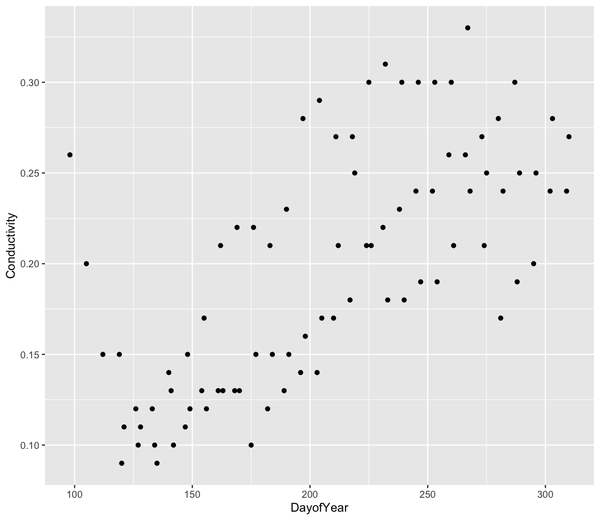
>
{: .challenge}

Hmm, the plot we created in the last exercise is a good start but it's hard to tell which points should be connected in this time series. What's going on? Since the dataset is more complex, the plotting options we used for the smaller dataset aren't as useful for interpreting these data. Luckily, we can add additional attributes to our plots that will make patterns more apparent. For example, we can generate a different type of plot -- perhaps a line plot -- and assign attributes for columns where we might expect to see patterns.

Let's review the columns and the types of data stored in our dataset to decide how we should group things together. To get an overview of our data object, we can look at the structure of `water_quality_oliver` using the `head()` function.

~~~
head(water_quality_oliver)
~~~
{: .language-r}

> ## Pro-tip
>
> The tidyverse also comes with a function for quickly seeing the structure of your `data.frame` called `glimpse()`. Try it and compare to the output from `head()`!
>
{: .testimonial}

(You can also review the structure of your data in the **Environment** tab by clicking on the blue circle with the arrow in it next to your data object name.)

So, what do we see? The column types are listed beneath the column names. These labels correspond to the type of data stored in each column.

What kind of data do we see?
* "dbl" = "Double" or "Numeric" (a non-whole number)
* "chr" = Character (categorical data)

Depending on the function and your R version, you may also see "int" or "lgl", which corresponds to "integer" (whole numbers) and "logical" (TRUE/FALSE values). 

**Note** In anything before R 4.0, categorical variables used to be read in as factors, which are a [special data object](https://www.tutorialspoint.com/r/r_factors.htm) that are used to store categorical data and have limited numbers of unique values. The unique values of a factor are tracked via the "levels" of a factor. A factor will always remember all of its levels even if the values don't actually appear in your data. The factor will also remember the order of the levels and will always print values out in the same order (by default this order is alphabetical).

Our plot has a lot of points from multiple years which makes it hard to see trends over time. A better way to view the data showing changes over time is to use a [line plot](http://www.sthda.com/english/wiki/ggplot2-line-plot-quick-start-guide-r-software-and-data-visualization). Let's try changing the geom to a line and see what happens.

~~~
ggplot(data = water_quality_oliver) +
    aes(x = DayofYear, y = Conductivity) +
    geom_line()
~~~
{: .language-r}

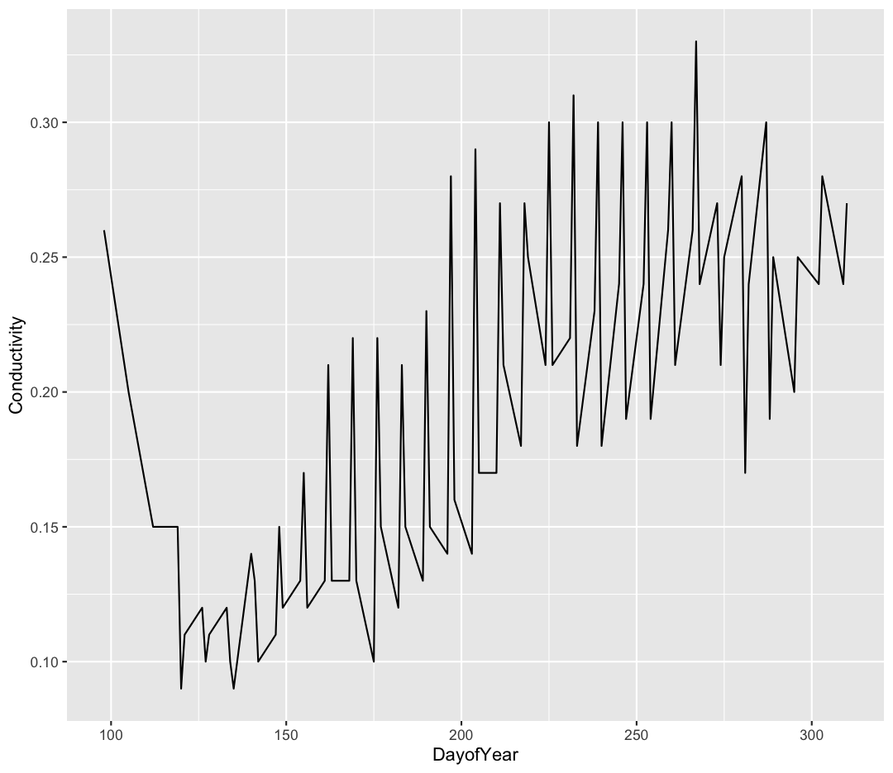

Hmm. This doesn't look right. We have data from 2022, 2023, and 2024, so ideally we should see a line from each. We need to tell ggplot this, specificallly - otherwise it is just connecting each dot by its order on the x-axis. We'll do this use the "group" argument.

~~~
ggplot(data = water_quality_oliver) +
    aes(x = DayofYear, y = Conductivity, group = Year) +
    geom_line()
~~~
{: .language-r}

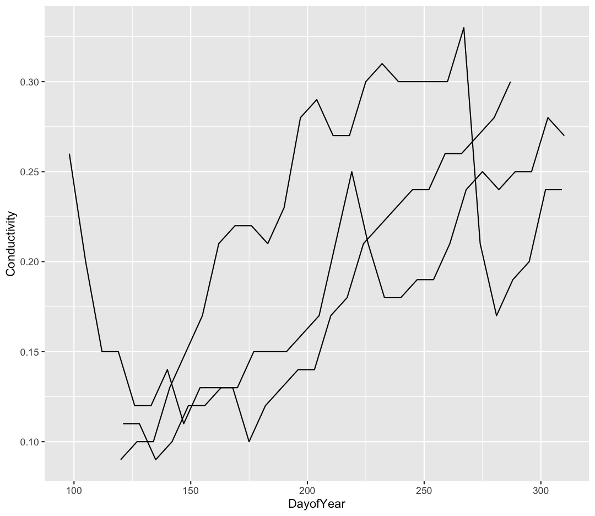

That's looking much better! Realistically, we probably want to see which year each line corresponds to. Let's add the `color` aesthetic to tell ggplot to change the line color. 

~~~
ggplot(data = water_quality_oliver) +
    aes(x = DayofYear, y = Conductivity, group = Year, color = Year) +
    geom_line()
~~~
{: .language-r}

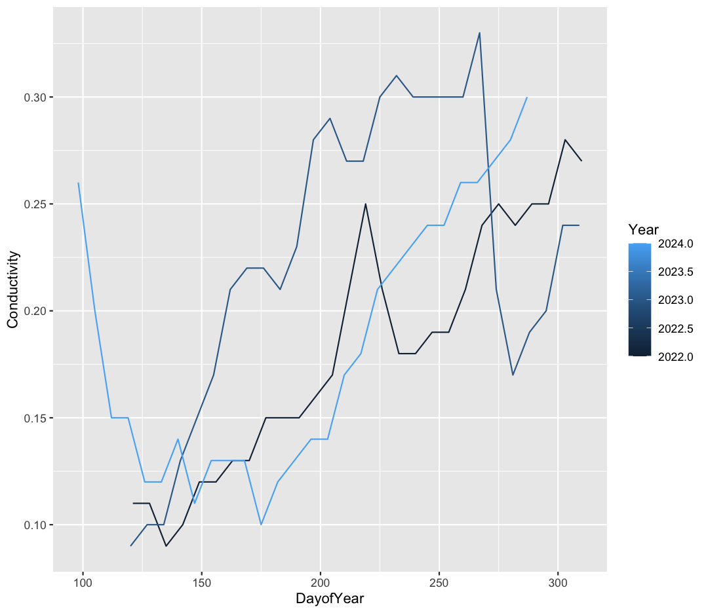

That's looking good! Real quick, though, something looks a little funky. Ggplot seems to be treating out the `Year` variable as a continuous variable (notice the gradient color scale), rather than as three discrete groups. Just as we modified our DO argument above, we can convert Year to a factor "on the fly" to tell R this is a categorical variable. 

~~~
ggplot(data = water_quality_oliver) +
    aes(x = DayofYear, y = Conductivity, group = Year, color = as.factor(Year)) +
    geom_line()
~~~
{: .language-r}

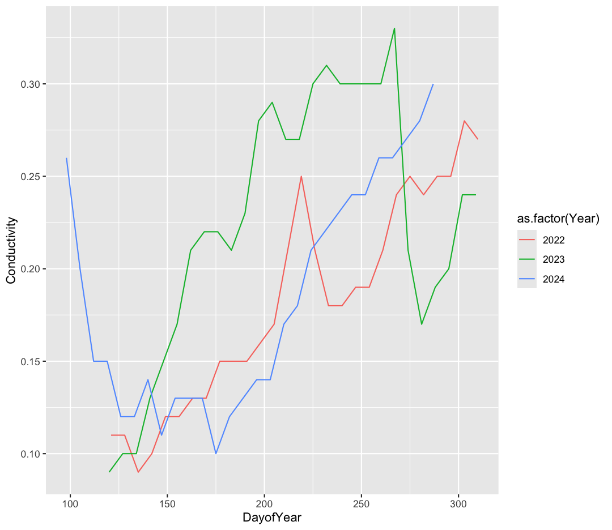

Excellent :) 

> ## Bonus Exercise: Fix the labels
> Great job making your first line plot! Though I don't like the "as.factor(Year)" in the legend. How can you update the color label?
>
> > ## Solution
> > 
> > ~~~
> > ggplot(data = water_quality_oliver) +
> >  aes(x = DayofYear, y = Conductivity, group = Year, color = as.factor(Year)) +
> >  geom_line() + 
> >  labs(color = "Year")
> > ~~~
> > {: .language-r}
> > 
> > 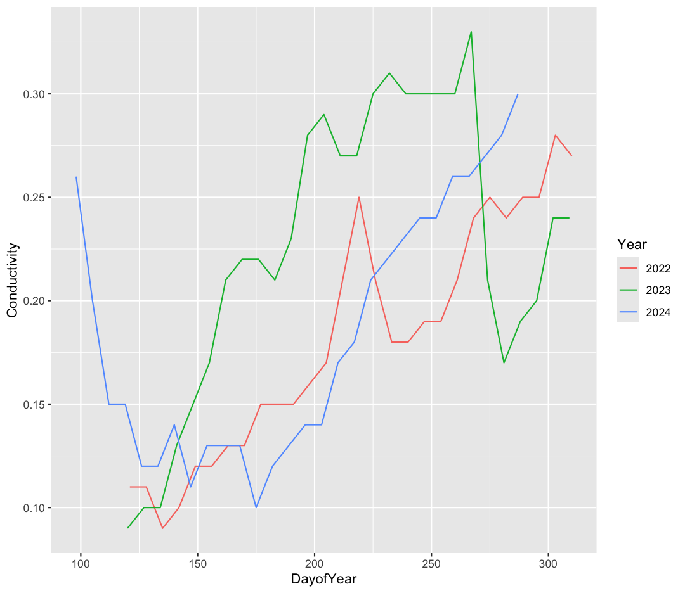
> >
> {: .solution}
{: .challenge}

What can we conclude about conductivity each year? Discuss with your partner what trends you see.

## Facets
_[Back to top](#contents)_

To create the plot above, we worked with a subset of the data, just from Oliver Bridge. But what if we want to look at this trend across all four stations? We'd have twelve lines, all on top of each other - this could be confusing! If you have a lot of different columns to try to plot or have distinguishable subgroups in your data, a powerful plotting technique called faceting might come in handy. When you facet your plot, you basically make a bunch of smaller plots and combine them together into a single image. Luckily, `ggplot` makes this very easy. Let's go back to our original water quality dataset, and try to make the same plot as above.

~~~
ggplot(data = water_quality) +
    aes(x = DayofYear, y = Conductivity, group = Year, color = as.factor(Year)) +
    geom_line()
~~~
{: .language-r}

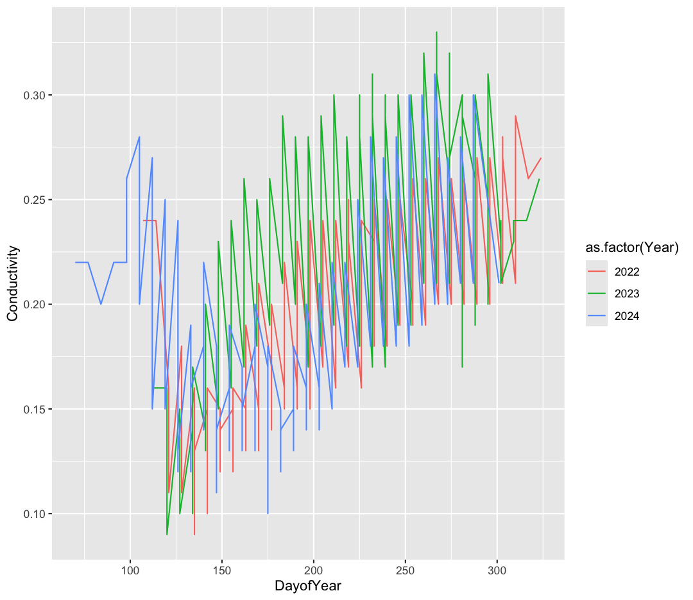

Hmmm - this is a mess. That's because each year's line is bouncing around between points from all four stations.

Now, let's make four separate plots, which correspond to each station. We can do this with `facet_wrap()`

~~~
ggplot(data = water_quality) +
    aes(x = DayofYear, y = Conductivity, group = Year, color = as.factor(Year)) +
    geom_line() + 
    facet_wrap(~Station)
~~~
{: .language-r}

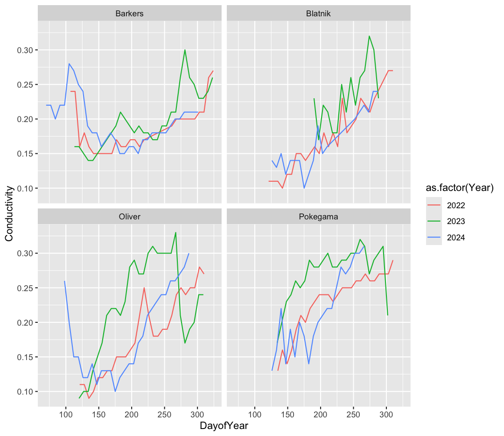

Note that `facet_wrap` requires this `~` in order to pass in the column names. You can interpret the `~` as "facet **by** this. We can see in this output that we get a separate box with a label for each station so that only the lines for the station are in that box. Now it is much easier to see trends in our data! We see that the increase in conductivity, caused by moderate drought in 2023, is especially clear at Oliver Bridge and Pokegama.

> ## Bonus Exercise: Free axes on faceted plots
> Sometimes, the range of values between facets is very different. Perhaps we want to emphasise the trends within each group, with less concern about comparing values between facets. We can modify the range of facet axes by adding the argument `scales = ` inside our `facet_wrap` command.
>
> > ## Example solution
> > 
> > ~~~
> > ggplot(data = water_quality) +
> >   aes(x = DayofYear, y = Conductivity, group = Year, color = as.factor(Year)) +
> >   geom_line() +
> >   facet_wrap(~Station, scales = "free_y")
> > ~~~
> > {: .language-r}
> > 
> > 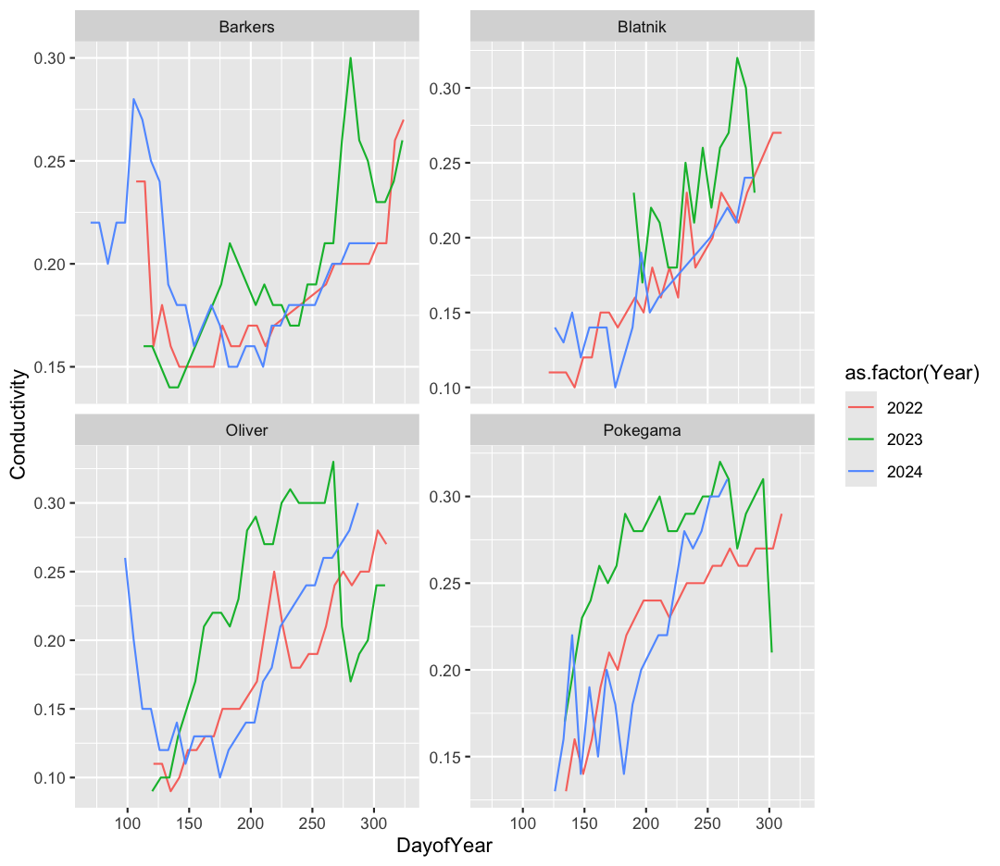
> {: .solution}
{: .challenge}

The other faceting function ggplot provides is `facet_grid()`. The main difference is that `facet_grid()` will make sure all of your smaller boxes share a common axis. In this example, we will stack all the boxes on top of each other into rows so that their x axes all line up.

~~~
ggplot(data = water_quality) +
  aes(x = DayofYear, y = Conductivity, group = Year, color = as.factor(Year)) +
  geom_line() + 
  facet_grid(rows = vars(Station))
~~~
{: .language-r}

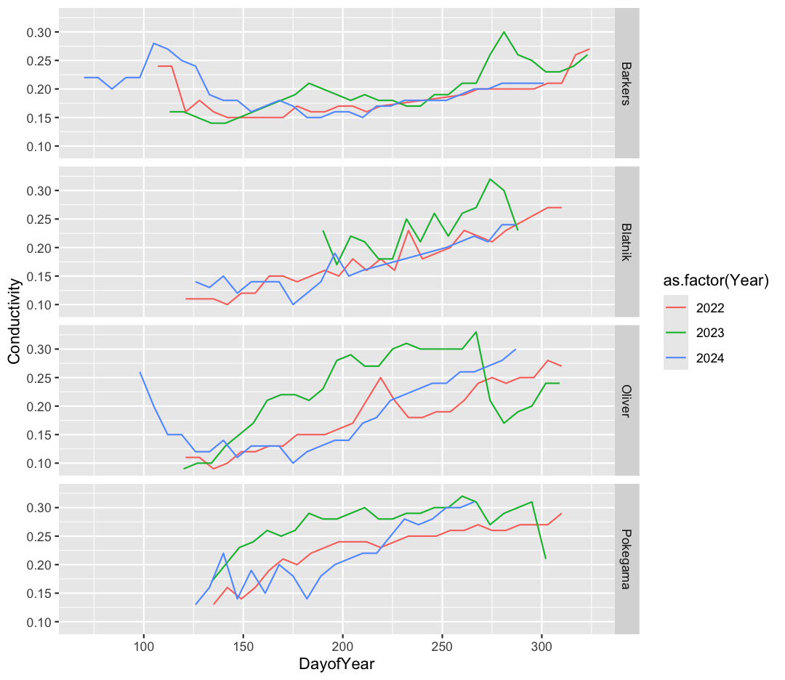

Unlike the `facet_wrap` output where each box got its own x and y axis, with `facet_grid()`, there is only one x axis along the bottom. We also used the function `vars()` to make it clear we're referencing the column `Station`.

## Discrete Plots
_[Back to top](#contents)_

So far we've looked at two plot types (`geom_point` and `geom_line`) which work when both the x and y values are numeric. But sometimes you may have one of your values be discrete (a factor or character).

We are going to read in one more dataset to practice some new plot types. This time, we'll work with **nutrient** data from the reserve, which requires monthly sampling and laboratory analysis. 

> ## Read in more data
>
> What argument should be provided in the below code to read in the full dataset?
>
> 
> ~~~
> september_nutrients <- read_csv()
> ~~~
> {: .language-r}
>
> > ## Solution
> >
> > 
> > ~~~
> > september_nutrients <- read_csv("september_nutrients.csv")
> > ~~~
> > {: .language-r}
> {: .solution}
{: .challenge}

Let's look at our new dataset. 

~~~
head(september_nutrients)
~~~
{: .language-r}

~~~
Error: object 'september_nutrients' not found
~~~
{: .error}

This dataset contains nutrient values from 2021-2023 taken in September at each station. We have orthophosphate (`PO4`, in mg/L as P), ammonium (`NH4`, in mg/L as N), nitrite/nitrate (`NOx`, in mg/L as N), and Chlorophyll-a (`Chl_a`, in ug/L). 

We've previously used the discrete values of the `Station` column to color our points. But now let's try moving that variable to the `x` axis. Let's say we are curious about comparing the distribution of different nutrients for each of the different `Stations`. We can do so using a box plot. Try this out yourself in the exercise below!

> ## Box plots
> Using the `september_nutrients` data, use ggplot to create a box plot with Station on the x axis and chlorophyll-a on the y axis. You can use the examples from earlier in the lesson as a template to remember how to pass ggplot data and map aesthetics and geometries onto the plot. If you're really stuck, feel free to use the internet as well!
>
> > ## Solution
> > 
> > ~~~
> > ggplot(data = september_nutrients) +
> >  aes(x = Station, y = Chl_a) +
> >  geom_boxplot()
> > ~~~
> > {: .language-r}
> > 
> > 
> > 
> > ~~~
> > Error: object 'september_nutrients' not found
> > ~~~
> > {: .error}
> {: .solution}
{: .challenge}

This type of visualization makes it easy to compare the range and spread of values across groups. The "middle" 50% of the data is located inside the box and outliers that are far away from the central mass of the data are drawn as points.

> ## Bonus Exercise: Other discrete geoms
> Take a look a the ggplot "data visualization" [cheat sheet](https://ggplot2.tidyverse.org/). Find all the geoms listed under "one discrete, one continuous". Try replacing `geom_boxplot` with one of these other functions.
>
> > ## Example solution
> > 
> > ~~~
> > ggplot(data = september_nutrients) +
> >   aes(x = Station, y = Chl_a) +
> >   geom_violin()
> > ~~~
> > {: .language-r}
> > 
> > 
> > 
> > ~~~
> > Error: object 'september_nutrients' not found
> > ~~~
> > {: .error}
> {: .solution}
{: .challenge}

## Layers
_[Back to top](#contents)_

So far we've only been adding one geom to each plot, but each plot object can actually contain multiple layers and each layer has it's own geom. Let's start with a basic boxplot:

~~~
ggplot(data = september_nutrients) +
  aes(x = Station, y = Chl_a) +
  geom_boxplot()
~~~
{: .language-r}

~~~
Error: object 'september_nutrients' not found
~~~
{: .error}

Box plots are a great way to see the overall spread of your data. However, it is good practice to also give your reader as sense of how many observations have gone into your boxplots. To do so, we can plot each observation as an individual point, on top of the boxplot.

~~~
ggplot(data = september_nutrients) +
  aes(x = Station, y = Chl_a) +
  geom_boxplot() +
  geom_point()
~~~
{: .language-r}

~~~
Error: object 'september_nutrients' not found
~~~
{: .error}

Ok, we've drawn the points but most of them stack up on top of each other. One way to make it easier to see all the data is to "jitter" the points, or move them around randomly so they don't stack up on top of each other. To do this, we use `geom_jitter` rather than `geom_point`

~~~
ggplot(data = september_nutrients) +
  aes(x = Station, y = Chl_a) +
  geom_boxplot() +
  geom_jitter()
~~~
{: .language-r}

~~~
Error: object 'september_nutrients' not found
~~~
{: .error}

Be aware that these movements are random so your plot will look a bit different each time you run it!

Now let's try switching the order of `geom_boxplot` and `geom_jitter`. What happens? Why?

~~~
ggplot(data = september_nutrients) +
  aes(x = Station, y = Chl_a) +
  geom_jitter() +
  geom_boxplot()
~~~
{: .language-r}

~~~
Error: object 'september_nutrients' not found
~~~
{: .error}

Since we plot the `geom_jitter` layer first, the  boxplot layer is placed on top of the `geom_jitter` layer, so we cannot see most of the points.

Note that each layer can have it's own set of aesthetic mappings. So far we've been using `aes()` outside of the other functions. When we do this, we are setting the "default" aesthetic mappings for the plot. We could do the same thing by passing the values to the `ggplot()` function call as is sometimes more common:

~~~
ggplot(data = september_nutrients, mapping = aes(x = Station, y = Chl_a)) +
  geom_boxplot() +
  geom_jitter()
~~~
{: .language-r}

~~~
Error: object 'september_nutrients' not found
~~~
{: .error}

However, we can also use aesthetic values for only one layer of our plot. To do that, you an place an additional `aes()` inside of that layer. For example, what if we want to change the size for the points so they are scaled by phosphate, but we don't want to change the box plot? We can do:

~~~
ggplot(data = september_nutrients) +
  aes(x = Station, y = Chl_a) +
  geom_boxplot() +
  geom_jitter(aes(size = PO4))
~~~
{: .language-r}

~~~
Error: object 'september_nutrients' not found
~~~
{: .error}

Both `geom_boxplot` and `geom_jitter` will inherit the default values of `aes(Station, Chl_a)` but only `geom_jitter` will also use `aes(size = PO4)`.

> ## Functions within functions
>
> In the two examples above, we placed the `aes()` function inside another function -- see how in the line of code `geom_jitter(aes(size = PO4))`, `aes()` is nested **inside** `geom_jitter()`? When this happens, R evaluates the inner function first, then passes the output of that function as an argument to the outer function. We also did this earlier, when we converted Year to a factor inside the ggplot call.
>
> Take a look at this simpler example. Suppose we have:
>
> 
> ~~~
> sum(2, max(6,8))
> ~~~
> {: .language-r}
> First R calculates the maximum of the numbers 6 and 8 and returns the value 8. It passes the output 8 into the sum function and evaluates:
> 
> ~~~
> sum(2, 8)
> ~~~
> {: .language-r}
> 
> 
> 
> ~~~
> [1] 10
> ~~~
> {: .output}
>
{: .solution}

## Color vs. Fill 
_[Back to top](#contents)_

Let's say we want to spice up our plot a bit by adding some color. Maybe we want our boxplot to have a fancy color like "pink." We can do this by explicitly setting the color aesthetic inside the `geom_boxplot` function. Note that because we are assigning a color directly and not using any values from our data to do so, we do not need to use the `aes()` mapping function. Let's try it out:

~~~
ggplot(data = september_nutrients) +
  aes(x = Station, y = Chl_a) +
  geom_boxplot(color="pink")
~~~
{: .language-r}

~~~
Error: object 'september_nutrients' not found
~~~
{: .error}

Well, that didn't get all that colorful. That's because objects like these boxplots have two different parts that have a color: the shape outline, and the inner part of the shape. For geoms that have an inner part, you change the fill color with `fill=` rather than `color=`, so let's try that instead

~~~
ggplot(data = september_nutrients) +
  aes(x = Station, y = Chl_a) +
  geom_boxplot(fill="pink")
~~~
{: .language-r}

~~~
Error: object 'september_nutrients' not found
~~~
{: .error}

That's some plot now isn't it! So "pink" maybe wasn't the prettiest color. R knows lots of color names. You can see the full list if you run `colors()` in the console. Since there are so many, you can randomly choose 10 if you run `sample(colors(), size = 10)`.

> ## choosing a color
>  Use `sample(colors(), size = 10)` a few times until you get an interesting sounding color name and swap that out for "pink" in the violin plot example.
>
{: .challenge}

We could also use a variable to determine the fill. Compare this to what you see when you map the fill property to your data rather than setting a specific value.

~~~
ggplot(data = september_nutrients) +
  aes(x = Station, y = Chl_a) +
  geom_boxplot(aes(fill=Station))
~~~
{: .language-r}

~~~
Error: object 'september_nutrients' not found
~~~
{: .error}

But what if we want to specify specific colors for our plots? The colors that
ggplot uses are determined by the color "scale". Each aesthetic value we can
supply (x, y, color, etc) has a corresponding scale. Let's change the colors to
make them a bit prettier. We can do that by using the function `scale_fill_manual`

~~~
ggplot(data = september_nutrients) +
  aes(x = Station, y = Chl_a) +
  geom_boxplot(aes(fill=Station)) +
  scale_fill_manual(values = c("pink", "tomato","orange1", "firebrick"))
~~~
{: .language-r}

~~~
Error: object 'september_nutrients' not found
~~~
{: .error}

Sometimes manually choosing colors is frustrating. There are many packages which produce pre-made palettes which you can supply to your data. A common one is `RColorBrewer`. We can use the palettes from RColorBrewer using the `scale_color_brewer` function. 

~~~
ggplot(data = september_nutrients) +
  aes(x = Station, y = Chl_a) +
  geom_boxplot(aes(fill=Station)) +
  scale_fill_brewer(palette = "Set1")
~~~
{: .language-r}

~~~
Error: object 'september_nutrients' not found
~~~
{: .error}

The `scale_color_brewer()` function is just one of many you can use to change
colors. There are bunch of "palettes" that are built-in. You can view them all
by running `RColorBrewer::display.brewer.all()` or check out the [Color Brewer
website](https://colorbrewer2.org/) for more info about choosing plot colors.

There are also lots of other fun options:

- [Viridis](https://cran.r-project.org/web/packages/viridis/vignettes/intro-to-viridis.html)
- [National parks](https://github.com/katiejolly/nationalparkcolors)
- [LaCroix](https://github.com/johannesbjork/LaCroixColoR)
- [Wes Anderson](https://github.com/karthik/wesanderson)

> ## Bonus Exercise: Lots of different palettes!
> Play around with different color palettes. Feel free to install another
> package and choose one of those if you want. Pick your favorite!
> {: .source}
>
> > ## Solution
> > You can use RColorBrewer::display.brewer.all() to pick a color palette. 
> > As a bonus, you can also use one of the packages listed above. 
> > Here's an example:
> > 
> > 
> > ~~~
> > #install.packages("wesanderson") # install package
> > library(wesanderson)
> > ggplot(data = september_nutrients) +
> >  aes(x = Station, y = Chl_a) +
> >  geom_boxplot(aes(fill=Station)) +
> >  scale_fill_manual(values = wes_palette("Cavalcanti1"))
> > ~~~
> > {: .language-r}
> > 
> > 
> > 
> > ~~~
> > Error: object 'september_nutrients' not found
> > ~~~
> > {: .error}
> > {: .source}
> {: .solution}
{: .challenge}

> ## Bonus Exercise: Transparency
> Another aesthetic that can be changed is how transparent our colors/fills are. The `alpha` parameter decides how transparent to make the colors. By default, `alpha = 1`, and our colors are completely opaque. Decreasing `alpha` increases the transparency of our colors/fills. Try changing the transparency of our boxplot. (**Hint:** Should alpha be inside or outside `aes()`?)
> > ## Solution
> > 
> > ~~~
> > ggplot(data = september_nutrients) +
> >   aes(x = Station, y = Chl_a) +
> >   geom_boxplot(fill="darkblue", alpha = 0.5)
> > ~~~
> > {: .language-r}
> > 
> > 
> > 
> > ~~~
> > Error: object 'september_nutrients' not found
> > ~~~
> > {: .error}
> {: .solution}
{: .challenge}

> ## Changing colors
> What happens if you run:
> 
> ~~~
>  ggplot(data = september_nutrients) +
>  aes(x = Station, y = Chl_a) +
>  geom_boxplot(aes(fill = "springgreen"))
> ~~~
> {: .language-r}
> 
> 
> 
> ~~~
> Error: object 'september_nutrients' not found
> ~~~
> {: .error}
> Why doesn't this work? How can you fix it? Where does that color come from?
>
> > ## Solution
> > In this example, you placed the fill inside the `aes()` function. Because you are using an aesthetic mapping, the "scale" for the fill will assign colors to values - in this case, you only have one value: the word "springgreen." Instead, try `geom_boxplot(fill = "springgreen")`.
> {: .solution}
{: .challenge}

## Univariate Plots
_[Back to top](#contents)_

We jumped right into making plots using multiple variables. But what if we wanted to take a look at just one column? In that case, we only need to specify a mapping for `x` and choose an appropriate geom. Let's start with a [histogram](https://www.thoughtco.com/what-is-a-histogram-3126359) to see the range and spread of the chlorophyll values

~~~
ggplot(september_nutrients) +
  aes(x = Chl_a) +
  geom_histogram()
~~~
{: .language-r}

~~~
Error: object 'september_nutrients' not found
~~~
{: .error}

You should not only see the plot in the plot window, but also a message telling you to choose a better bin value. Histograms can look very different depending on the number of bars you decide to draw. The default is 30. Let's try setting a different value by explicitly passing a `bin=` argument to the `geom_histogram` later.

~~~
ggplot(september_nutrients) +
  aes(x = Chl_a) +
  geom_histogram(bins=10)
~~~
{: .language-r}

~~~
Error: object 'september_nutrients' not found
~~~
{: .error}

Try different values like 5 or 50 to see how the plot changes.

> ## Bonus Exercise: One variable plots
> Rather than a histogram, choose one of the other geometries listed under "One Variable" plots on the ggplot [cheat sheet](https://ggplot2.tidyverse.org/). Note that we used `Chl_a` here which has continuous values. If you want to try the discrete options, try mapping `Station` to x instead.
>
> > ## Example solution
> > 
> > ~~~
> > ggplot(september_nutrients) +
> >   aes(x = Chl_a) +
> >   geom_density()
> > ~~~
> > {: .language-r}
> > 
> > 
> > 
> > ~~~
> > Error: object 'september_nutrients' not found
> > ~~~
> > {: .error}
> {: .solution}
{: .challenge}

> ## Bonus Exercise: One variable plots with a fill parameter
> From our previous work, we know that the distributions of cell abundances are very different between our environmental groups. How can we modulate the `fill` parameter of our density plot to show the differences between these groups?
>
> > ## Example solution
> > 
> > ~~~
> > ggplot(september_nutrients) +
> >   aes(x = Chl_a) +
> >   geom_density(aes(fill = Station), alpha = 0.5)
> > ~~~
> > {: .language-r}
> > 
> > 
> > 
> > ~~~
> > Error: object 'september_nutrients' not found
> > ~~~
> > {: .error}
> {: .solution}
{: .challenge}

## Plot Themes
_[Back to top](#contents)_

Our plots are looking pretty nice, but what's with that grey background? While you can change various elements of a `ggplot` object manually (background color, grid lines, etc.) the `ggplot` package also has a bunch of nice built-in themes to change the look of your graph. For example, let's try adding `theme_classic()` to our histogram:

~~~
ggplot(data = september_nutrients) +
  aes(x = Station, y = Chl_a) +
  geom_boxplot() +
  theme_classic()
~~~
{: .language-r}

~~~
Error: object 'september_nutrients' not found
~~~
{: .error}

Try out a few other themes, to see which you like: `theme_bw()`, `theme_linedraw()`, `theme_minimal()`.

> ## Rotating x axis labels
> Often, you'll want to change something about the theme that you don't know how to do off the top of your head. When this happens, you can do an Internet search to help find what you're looking for. To practice this, search the Internet to figure out how to rotate the x axis labels 90 degrees. Then try it out using the boxplot we made above. 
>
> > ## Solution
> > 
> > ~~~
> > ggplot(september_nutrients) +
> >   aes(x = Station, y = Chl_a) +
> >   geom_boxplot() +
> >   theme(axis.text.x = element_text(angle = 90, vjust = 0.5, hjust=1))
> > ~~~
> > {: .language-r}
> > 
> > 
> > 
> > ~~~
> > Error: object 'september_nutrients' not found
> > ~~~
> > {: .error}
> {: .solution}
{: .challenge}

## Saving plots
_[Back to top](#contents)_

We've made a bunch of plots today, but we never talked about how to share them with your friends who aren't running R! It's wise to keep all the code you used to draw the plot, but sometimes you need to make a PNG or PDF version of the plot so you can share it with your PI or post it to your Instagram story.

One that's easy if you are working in RStudio interactively is to use "Export" menu on the **Plots** tab. Clicking that button gives you three options "Save as Image", "Save as PDF", and "Copy To Clipboard". These options will bring up a window that will let you resize and name the plot however you like.

A better option if you will be running your code as a script from the command line or just need your code to be more reproducible is to use the `ggsave()` function. When you call this function, it will write the last plot printed to a file in your local directory. It will determine the file type based on the name you provide. So if you call `ggsave("plot.png")` you'll get a PNG file or if you call `ggsave("plot.pdf")` you'll get a PDF file. By default the size will match the size of the **Plots** tab. To change that you can also supply `width=` and `height=` arguments. By default these values are interpreted as inches. So if you want a wide 4x6 image you could do something like:

~~~
ggsave("awesome_plot.jpg", width=6, height=4)
~~~
{: .language-r}

> ## Saving a plot
>
> Try rerunning one of your plots and then saving it using `ggsave()`. Find and open the plot to see if it worked!
>
> > ## Example solution
> > 
> > ~~~
> > ggplot(september_nutrients) +
> >   aes(x = Chl_a) +
> >   geom_histogram(bins = 20)+
> >   theme_classic()
> > ~~~
> > {: .language-r}
> > 
> > 
> > 
> > ~~~
> > Error: object 'september_nutrients' not found
> > ~~~
> > {: .error}
> > 
> > 
> > 
> > ~~~
> > ggsave("awesome_histogram.jpg", width=6, height=4)
> > ~~~
> > {: .language-r}
> >
> > Check your current working directory to find the plot!
> {: .solution}
{: .challenge}

You also might want to just temporarily save a plot while you're using R, so that you can come back to it later. Luckily, a plot is just an object, like any other object we've been working with! Let's try storing our boxplot from earlier in an object called `box_plot`:

~~~
box_plot <- ggplot(data = september_nutrients) +
                  aes(x = Station, y = Chl_a) +
                  geom_boxplot(aes(fill=Station))
~~~
{: .language-r}

~~~
Error: object 'september_nutrients' not found
~~~
{: .error}

Now if we want to see our plot again, we can just run:

~~~
box_plot
~~~
{: .language-r}

~~~
Error: object 'box_plot' not found
~~~
{: .error}

We can also add changes to the plot. Let's say we want our boxplot to have the black-and-white theme:

~~~
box_plot + theme_bw()
~~~
{: .language-r}

~~~
Error: object 'box_plot' not found
~~~
{: .error}

Watch out! Adding the theme does not change the `box_plot` object! If we want to change the object, we need to store our changes:

~~~
box_plot
~~~
{: .language-r}

~~~
Error: object 'box_plot' not found
~~~
{: .error}

~~~
box_plot <- box_plot + theme_bw()
~~~
{: .language-r}

~~~
Error: object 'box_plot' not found
~~~
{: .error}

~~~
box_plot
~~~
{: .language-r}

~~~
Error: object 'box_plot' not found
~~~
{: .error}

We can also save any plot object we have named, even if they were not the plot that we ran most recently. We just have to tell `ggsave()` which plot we want to save:

~~~
ggsave("awesome_box_plot.jpg", plot = box_plot, width=6, height=4)
~~~
{: .language-r}

> ## Bonus Exercise: Create and save a plot
> Now try it yourself! Create your own plot of ammonium (`NH4`) across our stations using `ggplot()`, store it in an object named `my_plot`, and save the plot using `ggsave()`.
>
> > ## Example solution
> > 
> > ~~~
> > my_plot <- ggplot(data = september_nutrients)+
> >   aes(x = Station, y = NH4)+
> >   geom_boxplot(fill = "orange")+
> >   theme_bw()+
> >   labs(x = "Station", y = "NH4 (mg/L as N)")
> > ~~~
> > {: .language-r}
> > 
> > 
> > 
> > ~~~
> > Error: object 'september_nutrients' not found
> > ~~~
> > {: .error}
> > 
> > 
> > 
> > ~~~
> > ggsave("my_awesome_plot.jpg", plot = my_plot, width=6, height=4)
> > ~~~
> > {: .language-r}
> > 
> > 
> > 
> > ~~~
> > Error: object 'my_plot' not found
> > ~~~
> > {: .error}
> {: .solution}
{: .challenge}

# Glossary of terms
_[Back to top](#contents)_

- Aesthetic: a visual property of the objects (geoms) drawn in your plot (like x position, y position, color, size, etc)
- Aesthetic mapping (aes): This is how we connect a visual property of the plot to a column of our data
- Comments: lines of text in our code after a `#` that are ignored (not evaluated) by R
- Geometry (geom): this describes the things that are actually drawn on the plot (like points or lines)
- Facets: Dividing your data into non-overlapping groups and making a small plot for each subgroup
- Layer: Each ggplot is made up of one or more layers. Each layer contains one geometry and may also contain custom aesthetic mappings and private data
- Factor: a way of storing data to let R know the values are discrete so they get special treatment

